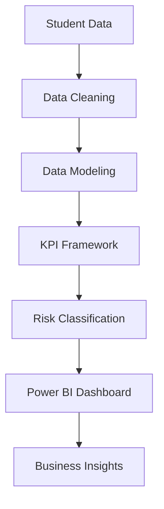

# Student Success Risk Analytics Dashboard

### Identifying At-Risk Students Through Data-Driven Insights

A Business Intelligence solution designed to help workforce development programs identify disengaged participants, prioritize interventions, and improve student success outcomes.

 

 

---

## Executive Summary

Training programs often struggle to identify students at risk before disengagement impacts performance and completion rates.

This dashboard transforms attendance records, coaching engagement, and project completion data into actionable insights that allow stakeholders to proactively support students and improve retention outcomes.

---

## Business Impact

<table>
<tr>
<td align="center">

## 216

Total Fellows

</td>

<td align="center">

## 95.64%

Attendance Rate

</td>

<td align="center">

## 56

Off-Track Students

</td>

<td align="center">

## 25.93%

Cohort Risk Rate

</td>
</tr>
</table>

---

## The Problem

Educational and workforce development programs require visibility into student engagement to identify intervention opportunities before performance declines.

Without a monitoring framework:

* Student disengagement goes unnoticed
* Intervention efforts become reactive
* Completion rates decrease
* Resources are allocated inefficiently

---

## The Solution

The Student Success Risk Analytics Dashboard centralizes three key engagement indicators into a single decision-support platform.

| KPI                | Requirement                 |
| ------------------ | --------------------------- |
| Attendance         | ≥ 70%                       |
| CSC Meetings       | ≥ 2 Meetings                |
| Project Completion | Required Projects Submitted |

Students failing one or more requirements are automatically classified as **Off Track**.

---

## Dashboard Features

### Executive Monitoring

* Attendance Performance
* Cohort Health Tracking
* Off-Track Student Monitoring
* Engagement Metrics

### Risk Detection

* Attendance Compliance
* Coaching Participation Compliance
* Project Completion Compliance

### Segmentation Analysis

* Teaching Assistant Analysis
* Career Success Coach Analysis
* Country Segmentation
* Student-Level Filtering

### Operational Insights

* Cohort Risk Distribution
* Engagement Patterns
* Intervention Opportunities

---

## Dashboard Walkthrough

### Executive Overview

Provides a high-level view of cohort performance and engagement.

### Student Monitoring

Enables detailed analysis of attendance, coaching participation, and project completion.

---

## Key Findings

### Coaching Engagement Is the Strongest Risk Indicator

41% of fellows were below the coaching participation threshold.

### Project Participation Declined Over Time

Project completion rates dropped significantly between exercises.

### Risk Concentration Varies Across Cohorts

Some instructional groups demonstrated higher concentrations of off-track students.

### Engagement Predicts Performance

Students with low coaching participation were more likely to miss project deadlines.

---

## Architecture

---

## Tech Stack

| Category              | Tools                     |
| --------------------- | ------------------------- |
| Business Intelligence | Power BI                  |
| Analytics             | KPI Design                |
| Data Modeling         | Relational Modeling       |
| Reporting             | Interactive Dashboards    |
| Insights              | Risk & Retention Analysis |

---

## Future Enhancements

* Student Risk Score
* Predictive Retention Analytics
* Early Warning System
* Automated Intervention Recommendations
* Multi-Cohort Benchmarking
* Machine Learning Classification Models

---

## Skills Demonstrated

* Business Intelligence
* Data Storytelling
* KPI Framework Design
* Cohort Analysis
* Risk Identification
* Stakeholder Reporting
* Dashboard Development
* Performance Monitoring

---

## Author

### Melissa Garrido

Business Intelligence • Data Analytics • Product Analytics

Connect With Me

Portfolio
https://melissagarridos.github.io/

LinkedIn
https://www.linkedin.com/in/melissavgs/

GitHub
https://github.com/melissagarridos

---

## Project Status

Completed and available for portfolio review.
